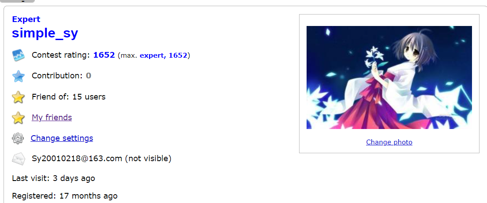
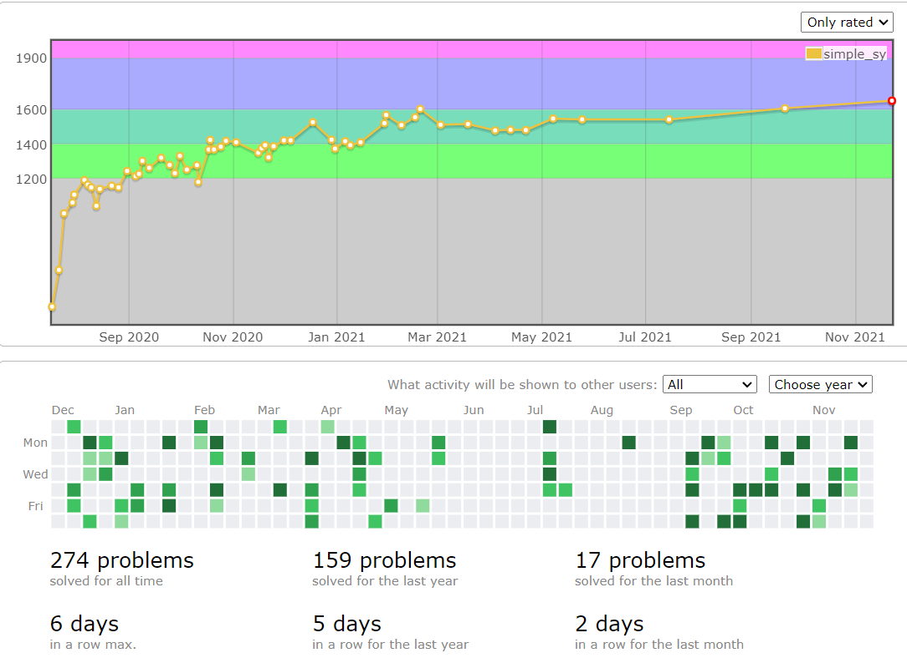
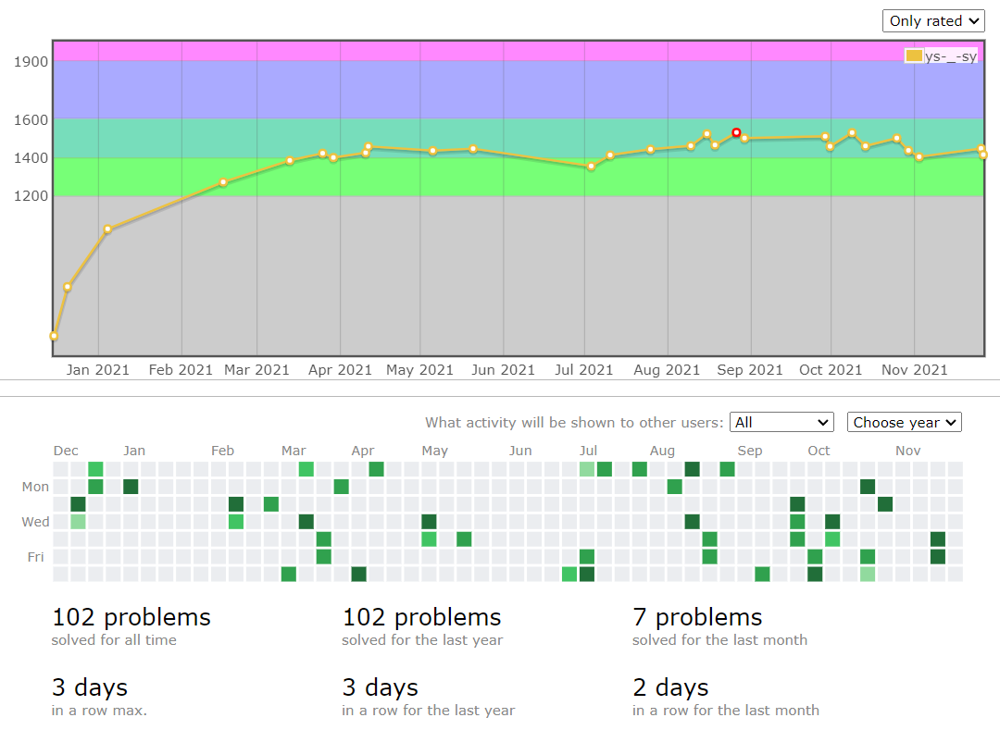
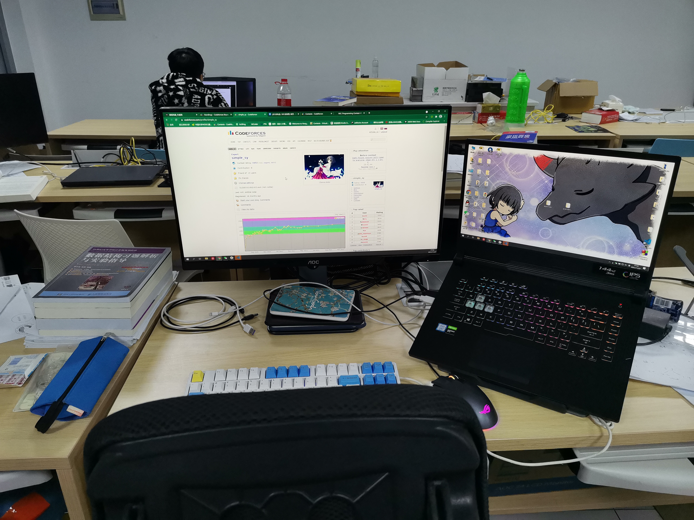

# ACM 退役总结

​	终于还是到了退役的那一天，大学的 ACM 之旅也到此结束了。想写一篇文章回顾一下自己参加 ACM 的整个历程，为自己这一年以来的学习历程做一个总结。

## 初识 $Fibonacci$ 数列

>假设一对刚出生的小兔一个月后就能长成大兔，再过一个月就能生下一对小兔，并且此后每个月都生一对小兔，一年内没有发生死亡，问：一对刚出生的兔子，一年内繁殖成多少对兔子?
>
>这是斐波那契数列非常经典的例题，对于第 $n$ 项 ：$A_n = A_{n-1} + A_{n-2}$。

​	其实参加 ACM 竞赛对大一的我来说是一条未曾设想的道路，甚至学不学计算机专业都还没有确定。我的学院希望大家宽厚基础，大二再选择自己的专业。我第一次了解到这个 ACM 竞赛还是大一下学期，童孟军老师（ACM 集训队的教练）来我学院宣传计算机专业，在向大家介绍杰出的计算机毕业生中很多都有 ACM 经历，而我当时想选择计算机专业，所以我就打算参加 ACM 竞赛来提高自己。就是这种机缘巧合下我走上了算法竞赛之路。

## 求 $Fibonacci$ 数列的第 $n(n \leqslant 30)$ 项

>C 语言最基础的递归训练题目，$fib(n) = fib(n - 1) + fib(n - 2)$

​	刚接触 ACM 竞赛我非常冲动，也不管自己有没有一点基础，就报名了当时的新生赛，我报名新生赛的时候离比赛只有一个星期的时间，而当时的我连 C 语言都不会！然后就一星期速成 C 语言参加了比赛。

​	第一次打新生赛真的啥都不会，我还记得我当时只写出了一道题，被同级的集训队队员吊打了，但是我也没有因此放弃。我在大一的暑假参加了 ACM 集训队的暑期集训，在最开始的一段时间，我几乎在每次个人赛中都排在倒数。我深刻的认识到了自己的菜，然后就每天都在实验室里面学习，在那段时间的学习过程中，我感受到了算法的神奇魅力，我渐渐的对算法产生了浓厚的兴趣，我因此热爱上了算法，也热爱 ACM 比赛，我的目标也从一开始参加 ACM 为了提高自己的能力，到后来我希望自己能够在比赛中拿到一块奖牌来证明自己。

## 求 $Fibonacci$ 数列的第 $n(n \leqslant 10^6)$ 项（对 $10^9 + 9$ 取模）

>在递归中，对于每一项的 $fib(n)$ 都搜索到了底，所以复杂度达到了 $O(2 ^ n)$，可以通过记忆化搜索或者动态规划的方式线性递推得到答案，这样的话复杂度就为 $O(n)$。

​	经过一个暑假的训练，我对算法竞赛有了更深的了解、学习了很多知识、打了很多练习赛，渐渐的我在个人赛中的排名一点点向前靠了，在大二上开学的那个学期的校赛中，我拿到了校赛的三等奖，这也是我第一次获奖，也是我第一次拿到竞赛奖金，因为当时的校赛是有华为奖的，所以奖金比较高，那 $500$ 元的奖金让我高兴了很久.

​	也因为校赛拿到了三等奖，我被分到了我们学校的三队参加的高校天梯赛（$10$ 人一队），那也是我第一次参加国赛，虽然这个比赛的含金量相对于 ICPC / CCPC（国际 / 中国 大学生程序设计竞赛） 而言不高，但是也是被学校认可的一个国赛啊，在那次比赛中我发挥的并不是很好，但是靠着队内大佬的超强实力，我们队拿到了国家级银奖，又到手 $500$ 元，这两个奖项给了我极大的动力。我既能做着自己喜欢的事情（学习算法）又可以收获国奖还有不少奖金然我真的非常开心。而且当时我绩点不高只拿了三等奖学金，不如我的比赛奖金，而我们学校没有保研，绩点对我来说重要性一下子降得很低，所以我投入了大量经历在训练上面，那个学期我的算法水平算是突飞猛进。

## 求 $Fibonacci$ 数列的第 $n(n \leqslant 10^{18})$ 项（对 $10^9 + 9$ 取模）

> 对于 $10^{18}$ 这个大小，线性递推的复杂度的显然已经无法求出答案了，所以可以通过矩阵递推 + 快速求幂次，也就是矩阵快速幂来求解，复杂度为 $O(log_2 n)$。

​	大二上学期的两个小奖给了我极大的信心，但是在那个学期 ICPC / CCPC 的比赛中我们队伍都是打铁的成绩（啥奖牌都没有），由于疫情的原因比赛名额比较多，我们拿到了很多本来大二拿不到的比赛机会。当时我们队伍在大二的队伍中算是比较弱的，所以我们没有比赛的优先选择权，但是运气非常好，正因为没有优先选择权，我轮到了大二下学期的 2020 赛季最后的区域赛机会——银川站，然后开启了“拿奖模式”。

​	大二下可以说是我拿奖拿的最爽的一个学期，我再一次拿到了高校天梯赛的全国银奖，又陆陆续续拿到了蓝桥杯（个人赛）的省一进入国赛，但在国赛中只拿到了国三。最重要的是我队伍（三人组）在 5 月份的浙江省赛中拿到了铜奖，然后我们前往宁夏银川，这是我们第一次出校打比赛，当时非常的兴奋。这场比赛的运气真的是非常非常的好，在银川站一开始由于紧张与缺乏经验打的非常差（罚时爆炸），在还剩一个小时（也就是封榜前）我们队还在铁牌区，我们当时其实有一点绝望，因为我们知道第 $4$ 题用什么算法，但是我们 **WA**了好几次，一直找不到原因，由于当时这道题是由我来写的，所以我又仔仔细细的看了一遍代码，发现了一个小错误（我当时对 $Trie$ 树的理解并不深，所以几乎是现学现写的），终于过了，当时我们真的非常激动，因为这是道铜牌题，过了它就意味着我们就能拿到奖牌了。不出意外，我们拿到了铜牌，也是我们第一次拿到区域赛的铜牌，现在想起当时的场景也是非常的激动，我拿牌的愿望终于实现了！

​	在银川之后，我们又去了西安的西北工业大学参加 ICPC 邀请赛，邀请赛相对于区域赛来说简单一点，我们就抱着旅游的心态去了，比赛又是磕磕绊绊，我们在写出一道签到题后，第二道题是一道期望题，大家都没有什么想法，当时队内的气氛一下子就压抑了起来，队友想不下去就换题了，然后我一个人想这道题，直到第三个小时，我发现这个题的答案好像是一个等比数列，所以我推出了公式后和队友说我想尝试一下，但也没有什么把握的，队友当时也没有在用电脑，然后我就上去打了一个 **快速幂 + 龟速乘**（其实不需要），我将自己推出来的公式实现了一下，然后测了样例没问题，但是由于那道题是 **除法取模** 的，只有对特殊的样例我们才能自己手算出答案，然后我和队友说想莽一发，他们对这道题没啥想法就答应了，然后我其实非常不自信的点了提交，当绿色的 **Accept** 出现时我自己都不敢相信，过了这道题基本上意味着拿铜牌稳了，然后大家又拥有了继续下去的信心，在封榜后又过了一题，最后以 $3$ 题结束比赛，可惜还是铜牌。由于出去比赛是非常吃经费的，然后我们队出去两次比赛都拿到了牌，这点让教练比较满意吧，我们就成为了集训队中的三队，这意味着我们下学期会有更多比赛机会和赛站的优先选择权。

## 求 $Fibonacci$ 数列的第 $n(n \leqslant 10^{10^6})$ 项（对 $10^9 + 9$ 取模）

>即便矩阵快速幂将复杂度优化到了 $O(log_2 n)$，但在这个复杂度下计算机依旧求不出这种大小规模的答案了，这时候神奇的数论出场了！Fibonacci 数列的通项公式是：
>$$
>a_n = \dfrac{1}{\sqrt{5}}\left [ \left ( \dfrac{1+\sqrt{5}}{2} \right )^n - \left ( \dfrac{1 - \sqrt{5}}{2} \right )^n   \right ]
>$$
>用二次剩余求出 $\sqrt{5}$ 对模数 $10^9+9$ 的逆元，然后代替通向公式中的 $\sqrt{5}$，并将系数全部换成逆元形式，再用费马-欧拉定理对式子进行欧拉降幂，就可以求得答案了。

​	转眼大三了，我知道这是 ACM 生涯的最后时间了，我大二暑假没回家，天天再实验室里面刷题，真的是可以称得上 每周几乎无休 + 朝九晚九了，只为了学更多的算法刷更多的题，想拿更多的牌，但是一直运气非常好的我，在这个赛季就没那么好运了，因为疫情这次的所有比赛都是在线上的，而且名额分配的非常多，但是奖牌数缺没有增加，这意味着非常恐怖的竞争，当然这也使得 ACM 区域赛奖牌的含金量更高了。我们参加了三站，济南 $700$ 队争 $200$ 块奖牌，堪称卷成经典，威海 $7$ 题中 $5$ 可以用 “多项式卷积” 过，可以说是 “卷”王了，上海一手 $Kruskal$ 重构树 + 树上倍增 杀死了我们最后希望。这个赛季就只能铁牌结束了，没办法了，虽然有很多遗憾与不甘，也要退役了，但是算法竞赛就是这样真实，打不过别人就是自己菜，所以我是真的菜！

## 求 $Fibonacci$ 数列的第 $\infty$ 项

> 我没学过，不会~

​	人退役了，但是我对算法的热爱并没有“退役”，我想这份热爱也许永远不会消退，因为我个人真的非常喜欢这种思维性的东西，每个算法里面都蕴含着前人的非常多的思维，学习算法就像是很前人对话一样，非常神奇。

​	参加 ACM 训练给我带来了很多，代码基本功、思维力、算法灵活运用，但是我觉得最重要的是一种追求更好（代码简洁），更快（复杂度低、运行更快）、更全面（不漏过一个细节）的精神，每当我解出一题，我总是会问自己存不存在更优的解法，我也习惯性的将这种最求极致的精神带入生活中，虽然这会拖慢我的脚步，但是也带给了我很多。正如 Fibonacci 数列是永无尽头的一样，我的学习之路也会是永无尽头的，我会一直追求下去。

​	我相信人的每个时间段都有更重要的事情，ACM 对我来说已经结束了，我也该进入新的阶段了，无论是学习技术还是考研，我都还有很长的路要走，但我也不会放弃算法的学习，有机会我还会继续学习算法。

很多图片算是我曾经努力过的见证吧。

每一个小点都是我的一次熬夜比赛，曾经的我几乎不愿意拉下任何一场比赛。

在实验室的一个大位置，实验室的环境非常好，学习氛围更好。

​	在弱校从大一下开始零基础打 ACM 竞赛，真的很难，时间真的非常短，平时还要上课，真的是挤时间学习，而与我们同台竞技的是来自 $985, 211$ 的选手，他们很多在高中就开始搞信息学竞赛，但是我们集训队的历届学长告诉我们没有什么不可能的，有零基础拿到区域赛金牌的王队，超队，还有仅仅参加半年多就拿到银牌的学长，有边考研边比赛的计算几何大师学长（拿过计算几何题的一血，并且是全场唯一一个过这道题的人），历届学长的经历都在激励我向前，从以前我们学校最高只能拿到铜牌到有一年拿到银牌，而在我加入集训队前，我们集训队又有了重大突破，拿到了第一块金牌。一届届集训队的传承使得集训队越发的强大，即便我们没有那些名校选手那么好的基础，几乎没有 $OI$ 选手，但是我们依旧在向前。

### 总结

回顾我的整个 ACM 历程，我还有很多很多没有做好的地方：

1. 自学能力依旧不够，没有利用好很多的资源。
2. 轻视了思维力，算法我学了很多，但是我的思维力依旧是偏弱的，我无法很好的运用我学过的算法。
3. 没有针对自己的弱点进行补短板，也就是补题太少，遇到一些不太会的题目就放弃。
4. 缺乏对自己训练的安排，学习路线安排有问题。

### 最后的感谢 

**感谢童孟军教练、王子超队长、杨成艺队长对我的帮助！**

**感谢我的两位队友的支持！**

